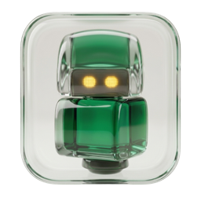

<div align="center">
  

  # Herbie

  **One window for every AI coding agent on your machine.**
</div>

Claude, Codex, Gemini, Hermes — they're all powerful, but they live in
separate terminals, have their own configs, and you can't get to any of
them from your phone. Herbie puts them under one roof: a tiny menubar
app that lets you pick the right agent for the job, shares your tools
and skills across all of them, runs them on a schedule, and bridges
them to Telegram so you can keep working from anywhere.

> _Screenshot coming soon — the composer with the agent dropdown open,
> showing Claude / Codex / Gemini / Kilo / OpenCode / Pi all listed._

---

## What it does

### Every agent, one window

Pick claude, codex, gemini, hermes — or any other ACP-compatible CLI —
from a dropdown. Switch between them mid-conversation. Each one keeps
its own model and reasoning preferences. You don't relearn the UI when
you swap.

### Their tools, your rules

Configure MCP servers and Skills once. Every agent inherits them. Wire
your Notion, Linear, or custom MCP into one place and claude, codex,
and gemini all see it — no more pasting the same JSON into three configs.

> _Screenshot coming soon — Settings → MCP, with a few servers
> configured and a note showing they're shared across agents._

### Tasks that actually run

Schedule prompts the way you schedule meetings. _"Every weekday at 9am,
summarise my GitHub notifications."_ _"Every Sunday, draft a
release-notes post from this week's merged PRs."_ Herbie wakes the
agent up, runs the prompt, and ships the result to your inbox.

> _Screenshot coming soon — Tasks page, two or three scheduled tasks,
> one of them mid-run with a streaming output._

### Mobile, even when the agent doesn't

Connect a Telegram bot once and every agent suddenly works from your
phone — including the ones with no mobile client of their own. Reply
to messages while waiting for coffee, kick off a long-running task
from a meeting, check on a scheduled task from bed.

> _Screenshot coming soon — Herbie on the desktop next to a Telegram
> chat with the same conversation on a phone._

---

## Why this exists

The agents are great. The plumbing is a mess.

- Claude has its window, Codex has another, Gemini has a third.
- You configure your MCP servers three times.
- There's no way to schedule anything — you rerun the same prompt by
  hand every Monday morning.
- And none of them work from your phone.

Herbie fixes the plumbing. The agents stay great, they just stop
fighting for your attention.

---

## Status

Public beta on macOS. Native menubar app (no dock icon, no Electron
weight) built on [Electrobun](https://electrobun.dev) and the
[Agent Client Protocol](https://github.com/agentclientprotocol/agentclientprotocol).
Local-first — your chats, tasks, and credentials live on your machine,
not in a cloud.

**Shipping today:**

- Composer with model, reasoning, and workspace pickers per agent
- MCP servers shared across every agent
- Skills (Claude / Codex / Gemini)
- Cron, interval, and weekly task scheduling
- Telegram bridge (one or many bots, each pinned to a specific agent)
- Custom agents — bring your own ACP-compatible CLI
- 17 ACP-compatible agents detected out of the box

**Coming next:**

- File attachments on the composer
- More mobile bridges (Discord, Signal, …)

---

## Install

Binary releases are landing soon. In the meantime, build from source:

```sh
git clone https://github.com/DaniAkash/herbie
cd herbie
bun install
bun run start
```

On first launch, Herbie asks you to pick a default workspace folder
(where your agents will spend most of their time). After that, click
the tray icon to open the popover.

> _Screenshot coming soon — first-run flow with the workspace picker._

---

## Supported agents

| Agent | How Herbie reaches it | Status |
|---|---|---|
| Claude Code | `@agentclientprotocol/claude-agent-acp` (via npx) | Tested |
| Codex CLI | `@zed-industries/codex-acp` (via npx) | Tested |
| Gemini CLI | `@google/gemini-cli` | Tested |
| Hermes Agent | `hermes acp` | Experimental |
| Kilo, OpenCode, Pi, Cursor, Droid, Copilot, iFlow, Kimi, Kiro, OpenClaw, Qoder, Qwen, Trae | acpx built-in registry | Detected |

If your agent speaks ACP, Herbie can drive it.

---

## Contributing

A detailed contribution guide — stack, dev loop, architecture, how to
add a new agent / MCP / mobile bridge — is coming in `CONTRIBUTING.md`.
For now: issues and PRs welcome.

---

## License

MIT — see [LICENSE](LICENSE).

Built by [@DaniAkash](https://github.com/DaniAkash).
